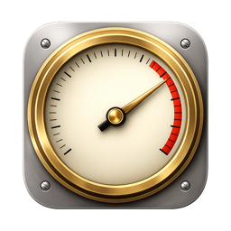
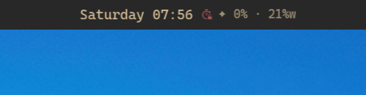
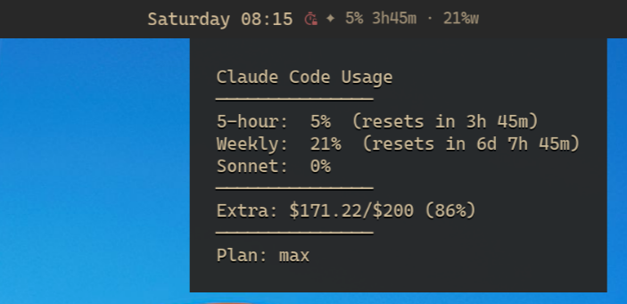
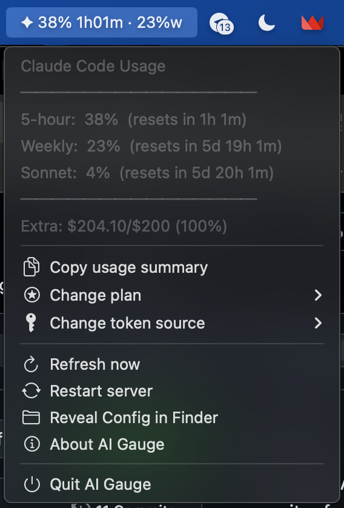
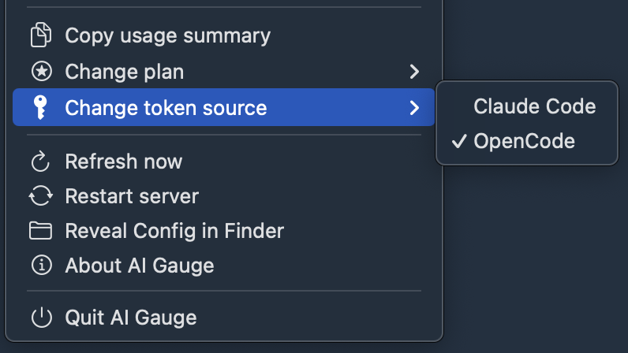
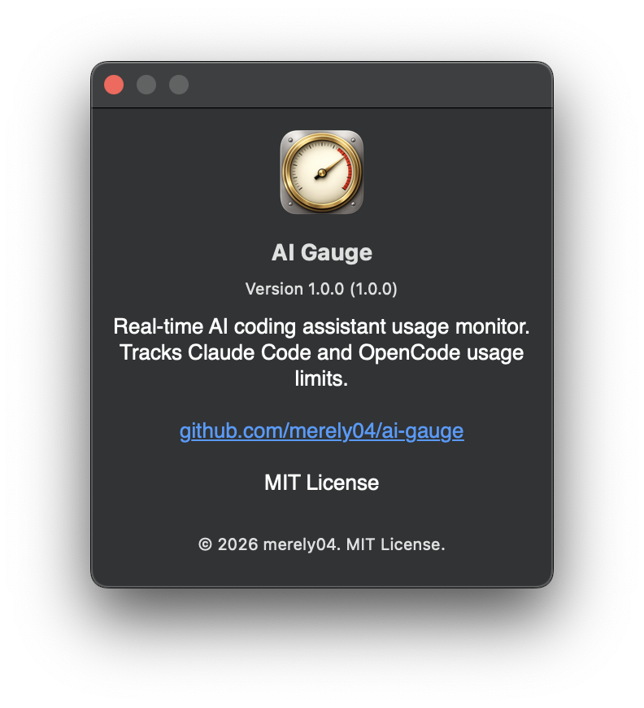
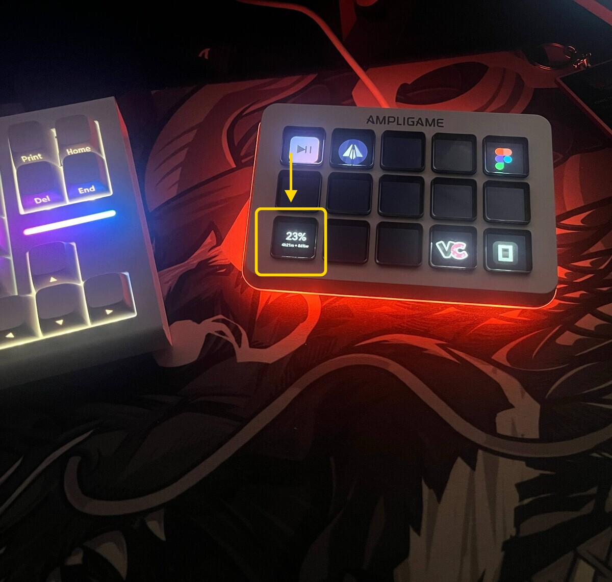

<h1 align="center">
  <br>
  AI Gauge
</h1>

<p align="center">
  Real-time Claude Code usage monitor. Tracks 5-hour and weekly API rate limits with countdown timers and desktop notifications.<br>
  Runs on Linux (Waybar) and macOS (native menubar app).
</p>

<p align="center">
  <a href="https://www.npmjs.com/package/ai-gauge"></a>
  <a href="https://github.com/merely04/ai-gauge/blob/master/LICENSE"></a>
  
  <a href="https://bun.sh"></a>
  <a href="https://github.com/merely04/ai-gauge/actions/workflows/publish.yml"></a>
</p>

```
✦ 44% 2h31m · 15%w
```

## Features

- **Waybar module** (Linux) — live 5-hour %, weekly %, reset countdown in your status bar
- **Native menubar app** (macOS) — Swift MenuBarExtra, same data in your menu bar
- **Desktop notifications** — alert at 80% usage, auto-clear below 50%
- **Right-click menu** — refresh, copy stats, change plan / token source with checkmarks (macOS), open settings
- **StreamDock plugin** — usage stats on a physical key (Fifine AmpliGame D6)
- **Multiple token sources** — Claude Code CLI or OpenCode
- **WebSocket architecture** — one server broadcasts to all clients in real time
- **systemd / launchd service** — starts on login, auto-restarts on failure
- **Zero dependencies** — runs on Bun, no npm packages

## LLM Agent Install

```
Read and follow the installation guide:
https://raw.githubusercontent.com/merely04/ai-gauge/master/docs/LLM_INSTALL.md
```

## Install

```bash
bun add -g ai-gauge
ai-gauge setup
```

To uninstall:

```bash
ai-gauge uninstall
bun remove -g ai-gauge
```

**Linux**: requires [Bun](https://bun.sh) and a desktop with Waybar (Hyprland, Sway, or any wlroots compositor).

**macOS**: requires [Bun](https://bun.sh) and macOS 13+. `ai-gauge setup` installs a native Swift menubar app and a launchd LaunchAgent instead of Waybar and systemd.

### macOS Gatekeeper — if the menubar icon doesn't appear

The `.app` bundle is **ad-hoc signed** (not notarized with an Apple Developer ID). `ai-gauge setup` automatically runs `xattr -dr com.apple.quarantine` to let macOS launch it, but a few edge cases may still trigger "cannot verify developer":

<details>
<summary><strong>Fix: one-liner that handles most cases</strong></summary>

```bash
xattr -dr com.apple.quarantine "$(bun pm -g bin)/../lib/node_modules/ai-gauge/bin/AIGauge.app"
launchctl bootout gui/$(id -u)/com.ai-gauge.menubar 2>/dev/null
launchctl bootstrap gui/$(id -u) ~/Library/LaunchAgents/com.ai-gauge.menubar.plist
```

</details>

<details>
<summary><strong>Still blocked? → System Settings → Privacy & Security</strong></summary>

1. Open **System Settings → Privacy & Security**
2. Scroll to the bottom — if you see a `"AIGauge" was blocked…` notice, click **Allow Anyway**
3. Reload the menubar agent (one-liner above)

</details>

<details>
<summary><strong>Check if quarantine is still set</strong></summary>

```bash
xattr -l "$(bun pm -g bin)/../lib/node_modules/ai-gauge/bin/AIGauge.app/Contents/MacOS/AIGauge"
```

If you see `com.apple.quarantine` in the output, the flag is still present — run the fix above.

</details>

<details>
<summary><strong>Edge cases (rare)</strong></summary>

- **Lockdown Mode** (System Settings → Privacy & Security → Lockdown Mode): ad-hoc signed apps are refused. Disable Lockdown Mode to use ai-gauge, or use only notarized software.
- **"Allow applications downloaded from: App Store only"**: change to **App Store and identified developers** in System Settings → Privacy & Security.
- **MDM / corporate device**: your admin may block unsigned binaries. Ask them to whitelist `com.ai-gauge.menubar`, or install a local build from source.

</details>

## What it shows

**Bar**: `✦ <5h%> <countdown> · <weekly%>w`



**Tooltip** (hover):

```
Claude Code Usage
───────────────
5-hour:  44%  (resets in 2h 31m)
Weekly:  15%  (resets in 6d 17h 54m)
Sonnet:  0%
───────────────
Extra: $171.22/$200 (86%)
```

The current plan and token source are reflected as **checkmarks in the submenu** (macOS) and in the Linux tooltip footer.



**States**:

| State | Color | Condition |
|-------|-------|-----------|
| normal | system text color | < 50% |
| warning | yellow | 50-79% |
| critical | red | >= 80% (sends desktop notification once) |
| waiting | very dim | Connecting to server (starting up or server down) |

## macOS — Native Menu Bar

Same data, native Mac UI. Lives in the menu bar (no Dock icon thanks to `LSUIElement`).

**In the menu bar:**


**Click to open the full menu** — usage breakdown on top, actions below:



**Submenus** show current selection with a checkmark — change plan or token source on the fly:



**About panel** — standard macOS About with version, license, GitHub link:



**Menu** (right-click on Linux, click on macOS):

- Copy usage summary (clipboard)
- Change plan ▸ (max / pro / team / enterprise / unknown — current marked with ✓)
- Change token source ▸ (Claude Code / OpenCode — current marked with ✓)
- Refresh now
- Restart server
- Reveal Config in Finder (macOS) / Open settings (Linux)
- About AI Gauge (macOS — shows version, license, GitHub link)
- Quit

## Configuration

Config file: `~/.config/ai-gauge/config.json`

```json
{"tokenSource": "claude-code", "plan": "max"}
```

| Field | Values | Description |
|-------|--------|-------------|
| `tokenSource` | `claude-code` (default), `opencode` | OAuth token source |
| `plan` | `max`, `pro`, `team`, `enterprise`, `unknown` | Subscription plan (shown in tooltip) |

Change settings via menu (macOS submenu / Linux walker UI) or CLI (works on both):

```bash
ai-gauge-config set tokenSource opencode
ai-gauge-config set plan max
ai-gauge-config get
```

## StreamDock (Fifine D6)

The plugin shows usage stats on a physical key of the Fifine AmpliGame D6 stream controller.



**Requirements**: Fifine D6 + StreamDock app running via Wine on Linux.

**Setup**: `ai-gauge setup` copies the plugin automatically. Open StreamDock → find **AI Gauge** in the action list → drag it onto a key.

The button connects to `ai-gauge-server` via WebSocket and updates in real time. If the server is not running, the button shows `--`.

## How it works

`ai-gauge-server` runs as a background daemon (systemd on Linux, launchd on macOS), polling the Anthropic usage API (`/api/oauth/usage`) every 60 seconds. It reads the OAuth token from either Claude Code CLI or OpenCode credentials and broadcasts results to all connected WebSocket clients on `ws://localhost:19876`.

On **Linux**, `ai-gauge-waybar` is a thin WebSocket client that renders each update as waybar-compatible JSON. On disconnect it shows a waiting state and reconnects automatically.

On **macOS**, `bin/ai-gauge-menubar` is a native Swift app using MenuBarExtra. It connects to the same WebSocket server and shows usage in the system menu bar.

The server writes `usage.json` atomically to `$XDG_RUNTIME_DIR/ai-gauge/` on Linux or `$TMPDIR/ai-gauge/` on macOS, so other tools can read it too.

## Files

| File | Purpose |
|------|---------|
| `bin/ai-gauge` | Main CLI — setup, uninstall, status |
| `bin/ai-gauge-server` | WebSocket server — fetches Anthropic API, broadcasts to clients (port 19876) |
| `bin/ai-gauge-waybar` | Thin WS client — renders waybar JSON from server data (Linux) |
| `bin/ai-gauge-menubar` | Native Swift menubar app binary — universal arm64+x86_64 (macOS) |
| `bin/ai-gauge-menu` | Click menu — refresh, copy, settings |
| `bin/ai-gauge-config` | Settings CLI/UI — token source, plan name |
| `lib/ai-gauge-server.service` | systemd user service unit template (Linux) |
| `lib/ai-gauge-server.plist.template` | launchd LaunchAgent plist template (macOS) |
| `lib/ai-gauge-menubar.plist.template` | launchd plist for the menubar app (macOS) |
| `bin/AIGauge.app/` | Pre-built macOS app bundle (universal arm64+x86_64, ad-hoc signed) |
| `macos/AIGauge/` | Swift source for the native menubar app (SPM project) |
| `scripts/build-macos-binary.sh` | Reproducible build: `swift build` + `lipo` + `codesign --deep` + bundle wrap |
| `scripts/generate-icon.sh` + `generate-icon.swift` | Procedural app icon renderer (Swift Core Graphics → `.icns`) |
| `lib/notify.js` | Cross-platform notification helper (notify-send on Linux, no-op on macOS) |
| `lib/bash-helpers.sh` | Portable `is_macos`, `resolve_path`, `sed_inplace` for bash scripts |
| `lib/streamdock-plugin/` | StreamDock (Fifine D6) button plugin |

Both setup and uninstall are idempotent.
